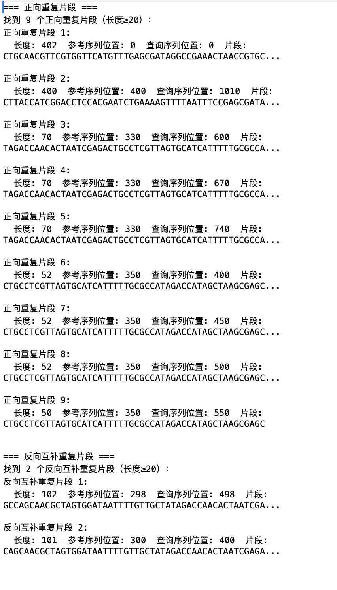

# DNA序列匹配算法 - 朴素动态规划实现

## 结果截图


## 算法概述

本项目实现了一个基于动态规划的DNA序列匹配算法，用于寻找两个DNA序列之间的重复片段和反向互补重复片段。该算法采用朴素的动态规划方法，时间复杂度为O(n²)，其中n是序列长度。

## 算法原理

### 动态规划方法

该算法使用动态规划表来记录两个序列之间的最长公共子串。对于参考序列reference和查询序列query，我们创建一个二维数组dp，其中dp[i][j]表示以reference[i-1]和query[j-1]结尾的最长公共子串的长度。

### 伪代码

```
Algorithm FindRepeats(reference, query)
    Input: reference sequence, query sequence
    Output: list of repeat segments with their positions
    
    // Initialize dynamic programming table
    dp[0...ref_len][0...query_len] = 0
    
    // Fill the dynamic programming table
    for i = 1 to ref_len do
        for j = 1 to query_len do
            if reference[i-1] == query[j-1] then
                dp[i][j] = dp[i-1][j-1] + 1
            else
                dp[i][j] = 0
            end if
        end for
    end for
    
    // Extract repeat segments
    repeats = empty list
    threshold = 10  // Minimum length threshold
    
    for i = 1 to ref_len do
        for j = 1 to query_len do
            if dp[i][j] >= threshold then
                // Check if it's a maximal repeat (cannot extend further)
                if i < ref_len and j < query_len and reference[i] == query[j] then
                    continue  // Can extend, not maximal
                end if
                
                // Extract the repeat segment
                length = dp[i][j]
                ref_start = i - length
                query_start = j - length
                segment = reference[ref_start...i-1]
                
                // Add to results
                repeats.append({
                    length: length,
                    ref_position: ref_start,
                    query_position: query_start,
                    segment: segment
                })
            end if
        end for
    end for
    
    // Sort by length in descending order
    Sort(repeats) by length in descending order
    
    return repeats
End Algorithm
```

### 反向互补匹配

```
Algorithm GetComplementSequence(sequence)
    Input: DNA sequence
    Output: reverse complement of the sequence
    
    complement_map = {'A': 'T', 'T': 'A', 'C': 'G', 'G': 'C'}
    complement_sequence = empty string
    
    for each base in reversed(sequence) do
        complement_sequence += complement_map[base]
    end for
    
    return complement_sequence
End Algorithm
```

## 算法复杂度分析

### 时间复杂度

- 创建动态规划表：O(n²)，其中n是序列长度
- 提取重复片段：O(n²)
- 总体时间复杂度：O(n²)

### 空间复杂度

- 动态规划表：O(n²)
- 结果列表：O(k)，其中k是找到的重复片段数量
- 总体空间复杂度：O(n²)

## 使用方法

1. 准备两个DNA序列文件：
   - `ref.txt`：参考序列
   - `query.txt`：查询序列

2. 运行程序：
   ```
   python lab1_naive_dp.py
   ```

3. 程序将输出：
   - 正向重复片段：参考序列和查询序列之间的直接匹配
   - 反向互补重复片段：参考序列和查询序列的反向互补序列之间的匹配
   - 结果将同时显示在控制台和保存到`result.txt`文件中

## 算法优化方向

当前实现的朴素动态规划算法时间复杂度为O(n²)，对于长序列处理效率较低。可以考虑使用后缀数组/后缀树等数据结构将算法优化到O(nlogn)，详见`optimization_guide.md`文件。